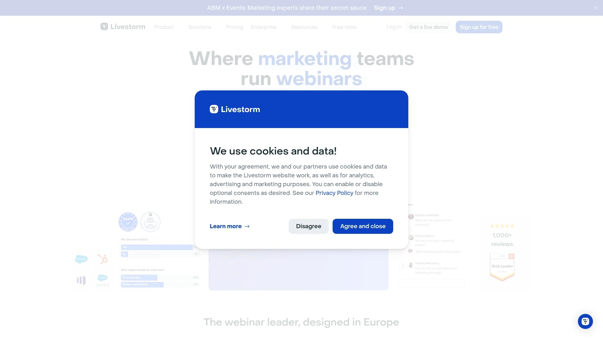
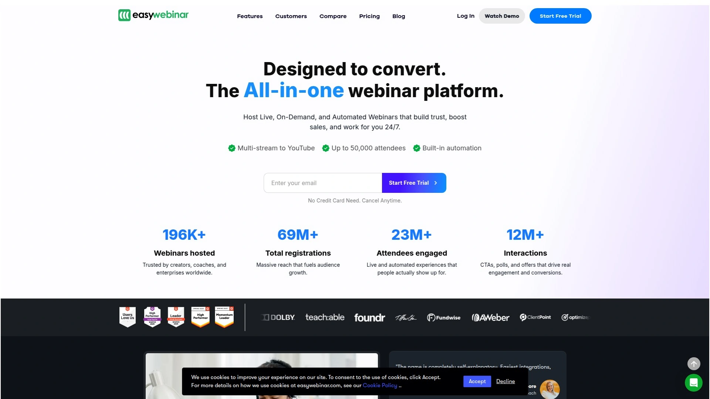
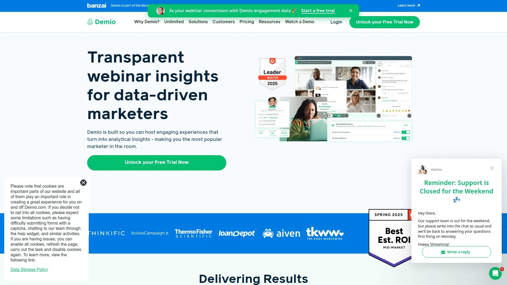
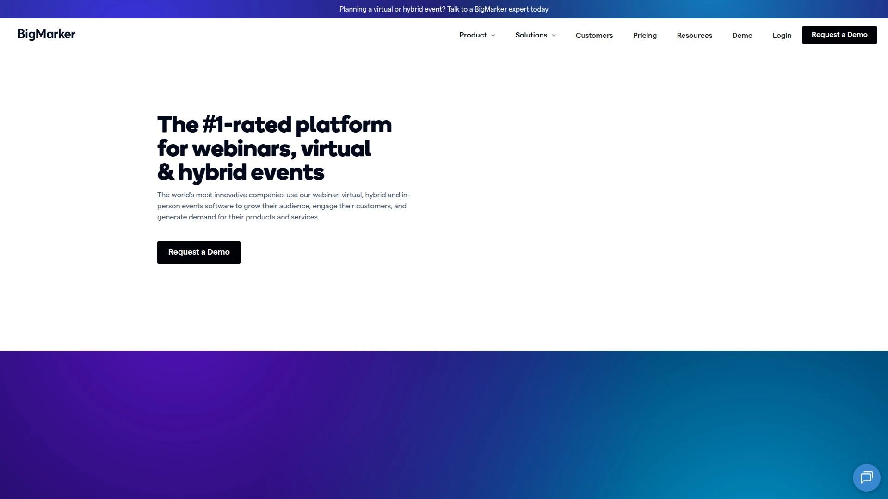
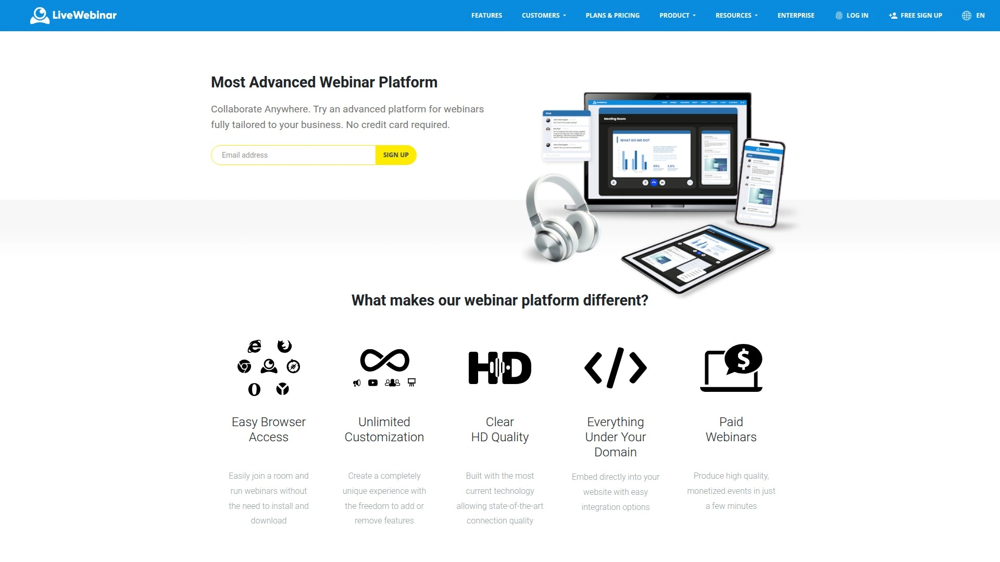

# Top 6 Best Webinar Platforms Tools in 2025

Tired of clunky, unreliable video calls for your marketing events? The right webinar platforms transform your presentations into smooth, interactive experiences that boost audience engagement. Finding a tool with robust event management features and powerful engagement tools is key to keeping your audience captivated and achieving your goals.

## [Livestorm](https://livestorm.co)

An end-to-end video engagement platform that supports live, on-demand, and automated webinars with smooth scheduling and multiple engagement tools.

Livestorm is designed to make interaction feel natural and effortless. It excels in live Q&A sessions, where its built-in features allow for seamless audience participation. You can customize registration pages to fit your brand and use live polls to gather real-time feedback. The platform also includes a question upvoting feature, which helps presenters prioritize the most popular inquiries from the audience. It simplifies the entire event workflow, from scheduling recurring events to sending one-click invites, letting you focus on content rather than technical setup.

* **Core Functions:** Offers a full suite of engagement tools, including chat, polls, and Q&A. It also provides an automated webinar workflow builder with a clear visual overview.
* **Applicable Scenarios:** Ideal for product demos, training sessions, and marketing webinars where audience interaction is crucial. It's suitable for both live and automated events.
* **Technical Advantages:** Integrates with a wide range of marketing tools, including HubSpot, to streamline data and lead management. It operates entirely in the browser, requiring no downloads for attendees.
* **Pricing Models:** Offers a free plan for short webinars and paid plans that scale with your needs, starting from $79 per month.

## [EasyWebinar](https://easywebinar.com)

A flexible platform known for its hybrid webinar capabilities and automated reminder systems that help boost attendance.

EasyWebinar is built to help businesses generate leads through engaging online events. It supports three distinct webinar formats: live events, simulated live presentations, and evergreen webinars that can run 24/7. This flexibility is perfect for creating hybrid events where you can mix pre-recorded content with live Q&A sessions. The platform's built-in email system automates reminders and follow-ups, which is a great asset for keeping your audience engaged before and after the event.

* **Core Functions:** Features include real-time chat, Q&A, and poll functionalities. It is designed to handle both marketing and educational content effectively.
* **Applicable Scenarios:** A great fit for businesses focused on lead generation and sales through online events. Its various formats also work well for training and onboarding.
* **Technical Advantages:** Offers strong automation for email sequences and event scheduling.

## [Demio](https://demio.com)

A cloud-based webinar software that offers a simple, no-download experience for attendees, along with all the tools needed to promote and monetize events.

Demio is designed with marketers in mind, providing features like live polls and downloadable handouts to create an interactive experience. It’s praised for its user-friendly interface and automation options for follow-up communications. The platform focuses on creating a seamless and professional look for your events without a steep learning curve.

* **Core Functions:** Provides interactive polls, Q&A, and featured actions to drive audience engagement. It also offers post-event analytics to track performance.
* **Target Users:** Best suited for marketers and businesses who want a straightforward, reliable platform for their promotional and educational webinars.
* **Differentiation Points:** The emphasis is on a clean, modern user experience for both the host and the attendees, with no software installation required.

## [ClickMeeting](https://clickmeeting.com)

A versatile platform for video conferencing, online meetings, and webinars, designed for users ranging from educators to enterprise-level marketers.

ClickMeeting shines when it comes to organizing recurring events. Its features for scheduling and automating sessions are straightforward, allowing you to manage a series of webinars without extensive manual work. It integrates easily with tools like Google Calendar and YouTube, which helps streamline everything from sending invitations to sharing recordings. The interface is simple enough for first-time users, and it can scale to accommodate different audience sizes.

* **Core Functions:** Includes interactive tools like surveys, moderated chat, and polls. It also has automated recording and sharing options.
* **Applicable Scenarios:** An excellent choice for periodic events, such as monthly training sessions or weekly team meetings. It's also used for larger virtual events and lead generation.
* **Technical Advantages:** Offers smart scheduling and can be integrated with payment platforms like PayPal for paid events.

## [BigMarker](https://bigmarker.com)

A feature-rich platform capable of hosting webinars for very large audiences, packed with tools for engagement and video conferencing.

BigMarker is more than just a webinar tool; it's a comprehensive web conferencing platform. It supports up to nine-way video conferencing, screen sharing, and includes features for ticketing and lead generation. One of its unique aspects is its attendee network, which can help new webinar hosts build an audience for their events. It’s also highly customizable and offers advanced analytics to monitor lead engagement.

* **Core Functions:** Features breakout rooms, Q&A, polls, and integrations with platforms like Twitter.
* **Applicable Scenarios:** Suited for large-scale virtual events, educational series, and any situation requiring extensive interactive tools and a large attendee capacity.
* **Differentiation Points:** Its ability to host events for over 1,000 attendees and its built-in network make it a powerful choice for those looking to maximize their reach.

## [LiveWebinar](https://livewebinar.com)

A cloud-based platform that specializes in both live and automated webinars, offering high-quality screen sharing and customized branding options.

LiveWebinar provides a robust set of features, including live video streaming and tools to boost engagement and sales. With over 40 data centers, it promises high uptime and 24/7 availability, ensuring a reliable experience for your audience. The platform also includes built-in tools to help users build marketing lists and automatically subscribe new leads to their CRM systems.

* **Core Functions:** Offers high-quality screen sharing, live streaming, and customizable branding. Its built-in email marketing tools help with lead nurturing.
* **Target Users:** A good option for businesses that need a dependable platform for frequent live events and want to automate their follow-up marketing processes.
* **Pricing Models:** Unlike many competitors, LiveWebinar offers a free plan for small webinars with up to five attendees, making it accessible for those just starting out.

## FAQ Common Questions

**How do I choose the right webinar platform?**
Focus on your primary goal. If it's marketing, look for strong integration and automation features. For training, prioritize interactive tools like polls and Q&A. Always check the platform's reliability and attendee limits.

**What features are essential for an engaging webinar?**
Look for live chat for real-time conversation, polls and surveys to gather audience feedback, and a Q&A section to address questions directly. Screen sharing and the ability to share files are also crucial for clear presentations.

## Conclusion

Choosing the best webinar tool depends on your specific needs, but the platforms listed here offer a great starting point for creating more stable, faster, and easier-to-manage virtual events. For those focused on creating a conversational and highly interactive experience, [Livestorm](https://livestorm.co) is particularly suitable for live Q&A scenarios, making it easy to engage directly with your audience and keep them hooked.
